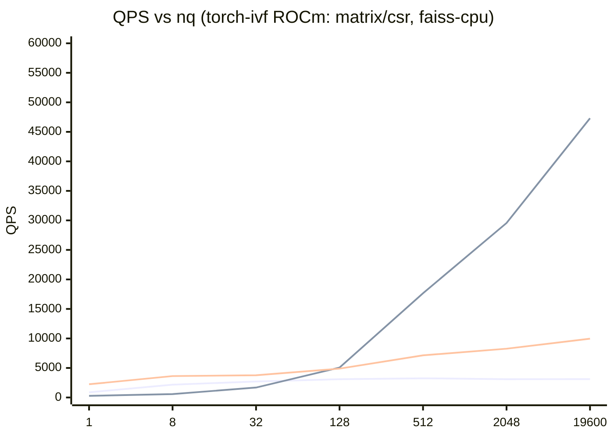

# torch-ivf（日本語）

**Faiss ライクに使える、PyTorch ネイティブ IVF。**  
CPU / CUDA / ROCm / DirectML を **同一コード**で扱えることを目標にしています（特に Windows + ROCm を重視）。

- ✅ **Faiss からの移行が簡単**（`IndexFlatL2/IP`, `IndexIVFFlat` 相当の API）
- ✅ **速い条件がはっきりしている**（tiny-batch vs throughput の二相、`search_mode=auto`）
- ✅ **PyTorch の backend が動けば同じコードで動く**（CUDA/ROCm/DirectML/CPU を統一）
- ✅ **throughput 領域で faiss-cpu を最大 4.7x**（実測。結果は `benchmarks/benchmarks.jsonl` / `benchmarks/env.json` に記録）

> English README: `README.md`

---

## 1分でわかる：Faiss ユーザー向け

| やりたいこと | Faiss | torch-ivf |
|---|---|---|
| 全探索（L2/IP） | `faiss.IndexFlatL2 / IP` | `torch_ivf.index.IndexFlatL2 / IP` |
| IVF（L2/IP） | `faiss.IndexIVFFlat` | `torch_ivf.index.IndexIVFFlat` |
| 速度チューニング | `nprobe` 等 | `nprobe` + `search_mode` + `max_codes` |

**GPU 推奨設定**：`search_mode="auto"`（tiny-batch は軽い経路、throughput は `csr`）

---

## どこで速い？（1枚まとめ）

- **tiny-batch（例: `nq <= 32`）**  
  カーネル起動オーバーヘッドが支配的になりやすく、CPU や `search_mode=matrix` が勝つことがあります。
- **throughput（例: `nq >= 512`）**  
  `search_mode=csr` が効きやすく、**faiss-cpu を複数倍上回る**ケースがあります。
- **推奨**  
  GPU では `search_mode="auto"` を既定にし、**可能ならクエリをまとめて投げてください**。

---

## 実測（代表値）

> ベンチ条件例: `nb=262144, train_n=20480, nlist=512, nprobe=32, k=20, float32, --warmup 1 --repeat 5`  
> 実行環境は `benchmarks/env.json` に保存（Windows / ROCm / PyTorch build など）  
> 数値は `scripts/benchmark_sweep_nq.py` の出力（`search_ms` は median）を要約
>
> 更新日時: `2025-12-14T10:40:28`

| nq | torch-ivf（ROCm GPU, matrix） | torch-ivf（ROCm GPU, csr） | faiss-cpu（CPU） |
|---:|---:|---:|---:|
| 512 | 3,250 QPS | **17,656 QPS** | 7,140 QPS |
| 2,048 | 3,105 QPS | **29,553 QPS** | 8,264 QPS |
| 19,600 | 3,109 QPS | **47,302 QPS** | 9,962 QPS |

---

## グラフ：QPS vs nq（tiny-batch → throughput）



---

## なぜ速い？（3行で）

- inverted list を **連続配置**して、ランダム `gather/index` を **`slice`** に置換
- 巨大 `topk` をやめ、list ごとの **`local topk + merge`（online / buffered）**に分解
- 距離計算を **GEMM 形（`Q @ X.T`）**に寄せ、ベンダー BLAS を活かす

---

## インストール（PyTorch は前提）

torch-ivf は PyTorch を **強制インストールしません**。  
CUDA/ROCm/DirectML/CPU など、利用環境に合った PyTorch を **先に**入れてから torch-ivf を入れてください。

- すでに PyTorch を入れている場合（推奨）:
  ```bash
  pip install torch-ivf
  ```
- CPU で手早く試したい場合（PyTorch も pip で入れる）:
  ```bash
  pip install "torch-ivf[pytorch]"
  ```

---

## クイックスタート

1) 合成データのデモ（まず動作確認）:
```bash
python examples/ivf_demo.py --device cpu --verify
python examples/ivf_demo.py --device cuda --verify
```

2) チュートリアル（利用者向け）:
- `docs/tutorial.ja.md`
- `docs/tutorial.en.md`

---

## 重要ポイント（転送オーバーヘッド削減）

- 目的 device 上でテンソルを生成する（`torch.randn(..., device=device)`）
- `add` / `search` はできるだけ **大きいバッチ**で呼ぶ（数千〜）
- `index = IndexIVFFlat(...).to(device)` は 1 回だけ。内部バッファは同じ device に常駐させる
- DataLoader 経由なら `pin_memory=True` と `tensor.to(device, non_blocking=True)` を使う

---

## ベンチマーク（スクリプト）

- `scripts/benchmark.py`: torch-ivf ベンチ（CPU/ROCm）。JSON を出力し `benchmarks/benchmarks.jsonl` に追記
- `scripts/benchmark_faiss_cpu.py`: faiss-cpu 参照ベンチ
- `scripts/benchmark_sweep_nq.py`: `nq` スイープ（tiny-batch vs throughput の境界）
- `scripts/benchmark_sweep_max_codes.py`: `max_codes` スイープ（速度/自己比較 recall）
- `scripts/dump_env.py`: `benchmarks/env.json` を生成
- `scripts/profile_ivf_search.py`: `IndexIVFFlat.search` の `torch.profiler` 表を表示

---

## 最小の再現手順（おすすめ）

README のグラフ/表を再現する最短手順です。

```bash
uv run python scripts/dump_env.py
uv run python scripts/benchmark_sweep_nq.py --torch-device cuda --torch-search-mode auto
uv run python scripts/benchmark_sweep_max_codes.py --torch-device cuda --torch-search-mode csr
```

結果は `benchmarks/benchmarks.jsonl` に追記されます。最新レコードに合わせて README の代表値を更新してください。

---

## 開発（uv）

```bash
uv sync
uv run pytest
```

---

## ドキュメント

- `docs/concept.md` – 背景と狙い
- `docs/spec.md` – 仕様（API/挙動）
- `docs/plan.md` – 進捗チェックリスト
- `docs/tutorial.ja.md` – チュートリアル（日本語）
- `docs/tutorial.en.md` – Tutorial (English)
