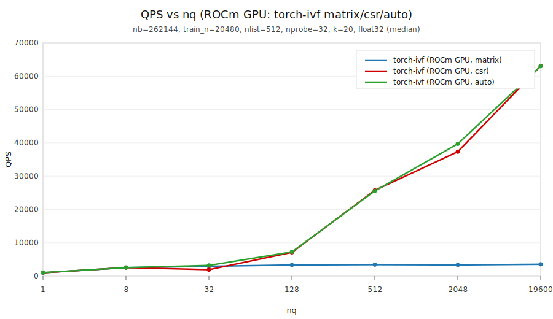
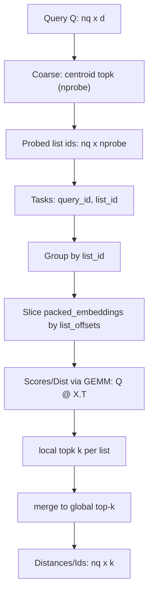

# torch-ivf（日本語）

**Faiss ライクに使える、PyTorch ネイティブ IVF。**  
CPU / CUDA / ROCm / DirectML を **同一コード**で扱えることを目標にしています（特に Windows + ROCm を重視）。

- 🔁 **Faiss 類似のAPIで移行が簡単**（`IndexFlatL2` / `IndexFlatIP`, `IndexIVFFlat` 相当の API）
- 📈 **throughput 領域で faiss-cpu を最大 5.20x**（`nq=19600` で 50,709 / 9,758 ≒ 5.20x）
- 🧩 **PyTorch の backend が動けば同じコードで動く**（CPU/CUDA/ROCm/DirectML。*One codebase across backends*）
- 🧪 **実測・再現手順あり**（env/jsonl + scripts 同梱。*Reproducible benchmarks included*）

> English README: `README.md`

---

## 📌 1分でわかる：Faiss ユーザー向け

Faiss の API との対比は下記です。チュートリアルもご参照ください（[`docs/tutorial.ja.md`](docs/tutorial.ja.md)）。

```python
from torch_ivf.index import IndexFlatL2, IndexFlatIP, IndexIVFFlat
```

| やりたいこと | Faiss | torch-ivf |
|---|---|---|
| 全探索（L2/IP） | `faiss.IndexFlatL2 / faiss.IndexFlatIP` | `torch_ivf.index.IndexFlatL2 / torch_ivf.index.IndexFlatIP` |
| IVF（L2/IP） | `faiss.IndexIVFFlat` | `torch_ivf.index.IndexIVFFlat` |
| 速度チューニング | `nprobe` 等 | `nprobe` + `search_mode` + `max_codes` |

**GPU 推奨設定**：`search_mode="auto"`（tiny-batch は軽い経路、throughput は `csr`）

---

## どういった領域で速いか？（1枚まとめ）

- **throughput（例: `nq >= 512`）　得意**  
  `search_mode=csr` が効きやすく、**faiss-cpu を複数倍上回る**ケースがあります。
- **tiny-batch（例: `nq <= 32`）不得意**  
  カーネル起動オーバーヘッドが支配的になりやすく、CPU や `search_mode=matrix` が勝つことがあります。
- **推奨設定**  
  GPU では `search_mode="auto"` を既定にし、**可能ならクエリをまとめて投げてください**（auto は tiny-batch では軽い経路、throughput では `csr` を選ぶ）。

---

## 📊 実測（代表値）

> ベンチ条件例: `nb=262144, train_n=20480, nlist=512, nprobe=32, k=20, float32, --warmup 1 --repeat 5`  
> 実行環境: AMD64 Family 26 Model 112 Stepping 0, AuthenticAMD / Windows 11 / PyTorch ROCm 7.1.52802-561cc400e1  
> 更新日時: `2025-12-24T18:08:10`（`scripts/benchmark_sweep_nq.py`、`search_ms` は median）
>
> ※この表は **`search_mode=auto` 固定**です（auto は tiny-batch では軽い経路、throughput では `csr` を選択）。最大 throughput を見たい場合は `search_mode=csr` を指定してください。
> faiss-cpu は既定スレッド設定（環境依存）です。再現する場合は `OMP_NUM_THREADS` を固定してください（例: Linux/macOS `export OMP_NUM_THREADS=16` / Windows `set OMP_NUM_THREADS=16`）。

| nq | torch-ivf（ROCm GPU, auto） | faiss-cpu（CPU） |
|---:|---:|---:|
| 512 | **20,017 QPS** | 6,271 QPS |
| 2,048 | **36,344 QPS** | 10,000 QPS |
| 19,600 | **50,709 QPS** | 9,758 QPS |

**速度優先パラメータ（任意・recall低下の可能性あり）**  
これらの条件でQPSを記載する場合は、パラメータも併記してください。
- `max_codes`（例: `32768`）で候補数の上限を設定する。
- `SearchParams(profile="approx", candidate_budget=32768, budget_strategy="distance_weighted", list_ordering="residual_norm_asc")`（L2のみ）。


### 近似プリセット（per-list 予算）

`SearchParams.profile` は per-list 予算つきの近似プリセットをサポートします。

- `approx_fast`: `candidate_budget=32768`, `use_per_list_sizes=True`
- `approx_balanced`: `candidate_budget=65536`, `use_per_list_sizes=True`
- `approx_quality`: `candidate_budget=131072`, `use_per_list_sizes=True`（下のベンチで recall~0.995）

例:

```python
from torch_ivf.index import SearchParams

params = SearchParams(profile="approx_quality")
scores, ids = index.search(xq, k=20, params=params)

# 明示的に上書きすることも可能です:
params = SearchParams(profile="approx_quality", candidate_budget=98304)
```

### プリセットの測定結果（per-list, csr）

> 上の表と同じ環境。`seed=1234`, `search_mode=csr`。

| candidate_budget | QPS | recall@k（unlimited 比） |
|---:|---:|---:|
| 32,768 | 54.9k | 0.930242 |
| 65,536 | 51.9k | 0.976895 |
| 98,304 | 53.8k | 0.990066 |
| 131,072 | 50.8k | 0.995046 |

注: 98,304（約96k）は recall~0.99 まで到達しますが、0.995 のゲートは満たしません。


### グラフ：QPS vs nq（tiny-batch → throughput）

赤: torch-ivf（ROCm GPU, auto） / 黒: faiss-cpu（CPU）



---

## 📦 インストール（PyTorch は前提）

torch-ivf は PyTorch を **強制インストールしません**。  
CUDA/ROCm/DirectML/CPU など、利用環境に合った PyTorch を **先に**入れてから torch-ivf を入れてください。

- すでに PyTorch を入れている場合（推奨）:
  ```bash
  pip install torch-ivf
  ```
- CPU で手早く試したい場合（PyTorch も pip で入れる）:
  ```bash
  pip install "torch-ivf[pytorch]"
  ```

---

## 🚀 クイックスタート

### 最小コード（自分のコードに埋め込む）

```python
import torch
from torch_ivf.index import IndexIVFFlat

d = 128
xb = torch.randn(262144, d, device="cuda", dtype=torch.float32)
xq = torch.randn(2048, d, device="cuda", dtype=torch.float32)

index = IndexIVFFlat(d=d, nlist=512, nprobe=32, metric="l2").to("cuda")
index.search_mode = "auto"
index.train(xb[:20480])
index.add(xb)

dist, ids = index.search(xq, k=20)
print(dist.shape, ids.shape)

# 速度/自己比較recallのトレードオフ（必要なときだけ）
# index.max_codes = 32768
```

1) 合成データのデモ（まず動作確認）:
```bash
python examples/ivf_demo.py --device cpu --verify
python examples/ivf_demo.py --device cuda --verify
```

2) チュートリアル（利用者向け）:
- [`docs/tutorial.ja.md`](docs/tutorial.ja.md)
- [`docs/tutorial.en.md`](docs/tutorial.en.md)

---

## 重要ポイント（転送オーバーヘッド削減）

- 目的 device 上でテンソルを生成する（`torch.randn(..., device=device)`）
- `add` / `search` はできるだけ **大きいバッチ**で呼ぶ（数千〜）
- `index = IndexIVFFlat(...).to(device)` は 1 回だけ。内部バッファは同じ device に常駐させる
- DataLoader 経由なら `pin_memory=True` と `tensor.to(device, non_blocking=True)` を使う

---

## ベンチマーク（スクリプト）

- [`scripts/benchmark.py`](scripts/benchmark.py): torch-ivf ベンチ（CPU/ROCm）。JSON を出力し [`benchmarks/benchmarks.jsonl`](benchmarks/benchmarks.jsonl) に追記
- [`scripts/benchmark_faiss_cpu.py`](scripts/benchmark_faiss_cpu.py): faiss-cpu 参照ベンチ
- [`scripts/benchmark_sweep_nq.py`](scripts/benchmark_sweep_nq.py): `nq` スイープ（tiny-batch vs throughput の境界）
- [`scripts/benchmark_sweep_max_codes.py`](scripts/benchmark_sweep_max_codes.py): `max_codes` スイープ（速度/自己比較 recall）
- [`scripts/benchmark_sweep_candidate_budget.py`](scripts/benchmark_sweep_candidate_budget.py): `candidate_budget` ?????approx ???/recall?
- [`scripts/dump_env.py`](scripts/dump_env.py): [`benchmarks/env.json`](benchmarks/env.json) を生成
- [`scripts/profile_ivf_search.py`](scripts/profile_ivf_search.py): `IndexIVFFlat.search` の `torch.profiler` 表を表示

---

## 最小の再現手順（おすすめ）

README のグラフ/表を再現する最短手順です。

```bash
uv run python scripts/dump_env.py
uv run python scripts/benchmark_sweep_nq.py --torch-device cuda --torch-search-mode auto
uv run python scripts/benchmark_sweep_max_codes.py --torch-device cuda --torch-search-mode csr
```

結果は [`benchmarks/benchmarks.jsonl`](benchmarks/benchmarks.jsonl) に追記されます。最新レコードに合わせて README の代表値を更新してください。

---

## なぜ速い？（ボトルネックを“構造”で潰す）

torch-ivf は、ただ距離計算を速くするだけではなく、IVF で支配的になりやすい **(A) 候補参照のランダムアクセス** と **(B) 巨大な選別（topk）** を、データレイアウトと探索手順の設計で潰す方針です。

### 1) まず「どこが遅いか」をプロファイルで確定

当てずっぽうの高速化を避けるため、`torch.profiler` でホットスポットを確認します。

- 使うもの: [`scripts/profile_ivf_search.py`](scripts/profile_ivf_search.py)
- 発見したこと:
  - `matrix` 側: `aten::index_select` / `aten::gather` / 大きい `aten::topk` が支配しやすいことがわかりました。
  - `csr` 側: “ランダム参照（gather 系）” の比率が下がり、`slice` + GEMM が主体になりやすいことがわかりました。

### 2) gather → slice（list を連続配置してランダムアクセスを消す）

GPU にとって厳しいのは、候補ベクトルへのアクセスが「飛び飛び」になることです（`gather/index_select` が多い）。

torch-ivf は `add` の段階で、inverted list ごとに **ベクトルを連続配置**し、検索時は `slice` で候補を取れる形にしました。

- 概念的なレイアウト:
  - `packed_embeddings`: list 単位に並び替えたベクトル（連続）
  - `list_offsets[l]:list_offsets[l+1]`: list `l` の `[start:end)` 範囲
  - `list_ids`: packed の行 → 元ID の対応

これにより候補の取り出しが

- 以前: `index_select/gather`（ランダム）
- いま: `packed_embeddings[start:end]`（連続 `slice`）

となり、メモリアクセスの性質が改善しました。

### 3) 巨大 topk → local topk + merge（選別を小さくして回数を最適化）

`matrix` パスは「候補を固定形状の行列に詰めて、1 回の大きい `topk`」になりやすく、候補数が膨らむと `topk` と中間テンソルのメモリ移動が支配的になります。

`csr` パスは list 単位に分割して処理しました:

1. list の候補 `X` を `slice` で取得
2. `Q @ X.T` で距離（スコア）を作る
3. list 内で `local_topk(k)`
4. `merge` で全体 top-k を更新（online / buffered）

この形にすると、常に「小さい topk」を回せるため、throughput 領域で伸びやすくなりました。

### 4) GEMM 形に寄せる（ベンダー BLAS を最大限使う）

距離計算は可能な限り行列積（GEMM）に寄せます。

- IP: `scores = Q @ X.T`
- L2: `||q-x||^2 = ||q||^2 + ||x||^2 - 2 (Q @ X.T)`

ROCm/CUDA の BLAS（rocBLAS/cuBLAS）を活かしやすい形なので、GPU での throughput が出やすくなりました。

### 5) 処理イメージ（検索の流れ）



---

## 開発（uv）

```bash
uv sync
uv run pytest
```

---

## ドキュメント

- [`docs/concept.md`](docs/concept.md) – 背景と狙い
- [`docs/spec.md`](docs/spec.md) – 仕様（API/挙動）
- [`docs/plan.md`](docs/plan.md) – 進捗チェックリスト
- [`docs/tutorial.ja.md`](docs/tutorial.ja.md) – チュートリアル（日本語）
- [`docs/tutorial.en.md`](docs/tutorial.en.md) – Tutorial (English)

