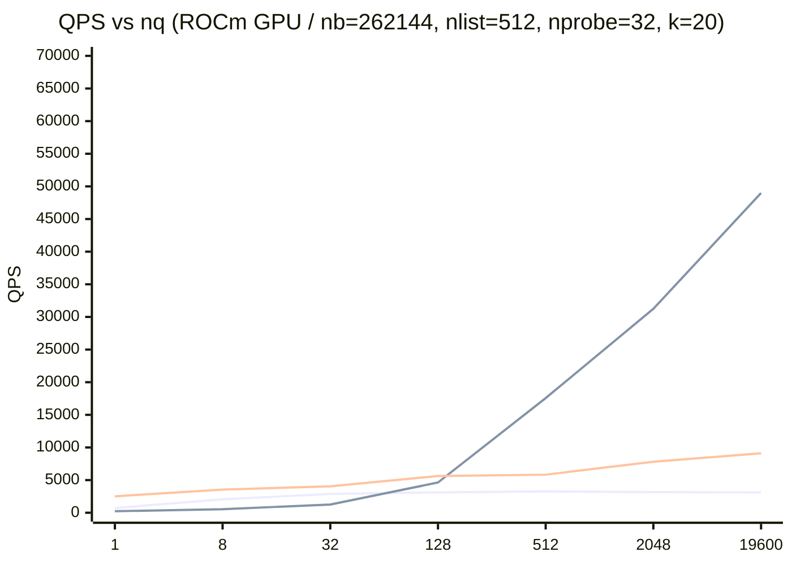

# torch-ivf

torch-ivf is a PyTorch-native IVF (Inverted File Index) library that mimics the Faiss `IndexFlat` / `IndexIVFFlat` APIs while running on CPU, CUDA, ROCm, or DirectML from the same codebase. The project is developed primarily on Windows + ROCm PyTorch, so that GPU search workloads can run without switching libraries per vendor.

## When It’s Fast (one-screen summary)

- Tiny batches (e.g., `nq <= 32`): kernel launch overhead dominates; CPU or `search_mode=matrix` may win.
- Throughput regime (e.g., `nq >= 512`): `search_mode=csr` typically dominates and can exceed faiss-cpu by multiples.
- Recommended default: set `search_mode="auto"` (GPU), and send larger query batches when possible.

## Why It’s Fast (in 3 lines)

- Replace random `gather/index_select` with contiguous `slice` by packing vectors per list.
- Replace one huge `topk` with `local topk + merge` (online/ buffered) per list.
- Form distances via GEMM-style ops (`Q @ X.T`) to leverage vendor BLAS on GPU.

## Quick Start

## Installation (PyTorch prerequisite)

torch-ivf does not force-install PyTorch because you may need a specific wheel variant (CUDA/ROCm/DirectML/CPU).

- If you already have PyTorch installed (recommended for CUDA/ROCm/DirectML), install torch-ivf:
  ```bash
  pip install torch-ivf
  ```
- If you want a quick CPU-only setup, you can let pip install a compatible PyTorch:
  ```bash
  pip install "torch-ivf[pytorch]"
  ```

1. Run the demo with synthetic vectors.
   ```bash
   python examples/ivf_demo.py --device cpu --verify
   python examples/ivf_demo.py --device cuda --verify
   ```
   Use `--device cpu` / `--device cuda` / `--device dml` as needed. `--verify` compares against `IndexFlat`.
2. Read the user tutorial:
   - English: `docs/tutorial.en.md`
   - Japanese: `docs/tutorial.ja.md`

## Development (uv)

This repository uses `uv` for development.

```bash
uv sync
uv run pytest
```

## Best Practices (reduce transfer overhead)

- Generate tensors directly on the target device (`torch.randn(..., device=device)`).
- Feed large mini-batches to `add` / `search` (thousands of vectors per call) to reduce PCIe transfers.
- Move the index once (`index = IndexIVFFlat(...).to(device)`) and keep all internal buffers on that device.
- When loading data via DataLoader, use `pin_memory=True` and `tensor.to(device, non_blocking=True)`.
- Keep metadata (`list_ids`, etc.) on the device; only bring final results back to the host.

```python
loader = DataLoader(ds, batch_size=4096, pin_memory=True, num_workers=4)
index = IndexIVFFlat(d, nlist=512).to(device)
for xb, _ in loader:
    xb = xb.to(device, non_blocking=True)
    index.add(xb)
```

## Device Support Matrix

| Device / API        | Status  | Notes                                            |
|---------------------|---------|--------------------------------------------------|
| CPU (x86/ARM)       | ✅       | All tests run on CPU.                            |
| CUDA (NVIDIA)       | ✅       | `IndexFlat*` / `IndexIVFFlat` operate on CUDA.   |
| ROCm (Linux)        | ✅       | Same code path, tested on ROCm builds.           |
| ROCm (Windows)      | ✅       | Primary dev environment (Windows + ROCm PyTorch).|
| DirectML (Windows)  | ⚠️ Experimental | Basic smoke tests only.                  |

## Documentation

- `docs/concept.md` – background and goals
- `docs/spec.md` – API specification and behavior
- `docs/plan.md` – checklist-style progress tracking
- `docs/tutorial.en.md` – user tutorial (English)
- `docs/tutorial.ja.md` – user tutorial (Japanese)

## Benchmarks

- `scripts/benchmark.py`: torch-ivf benchmark (CPU/ROCm). Outputs JSON with hardware metadata.
- `scripts/benchmark_faiss_cpu.py`: faiss-cpu reference benchmark.
- `scripts/benchmark_sweep_nq.py`: sweep `nq` to reveal tiny-batch vs throughput regimes.
- `scripts/dump_env.py`: dump a reproducible environment snapshot to `benchmarks/env.json`.
- `scripts/profile_ivf_search.py`: print a short `torch.profiler` table for `IndexIVFFlat.search`.

Example:
```bash
uv run python scripts/benchmark.py --device cpu --nb 32768 --nq 128 --json
uv run python scripts/benchmark.py --device cuda --nb 32768 --nq 128 --search-mode auto --json
uv run python scripts/benchmark_faiss_cpu.py --nb 32768 --nq 128
uv run python scripts/dump_env.py
```

### Minimal Repro (recommended)

This is the shortest path to reproduce the benchmark tables:

```bash
uv run python scripts/dump_env.py
uv run python scripts/benchmark_sweep_nq.py --torch-device cuda --torch-search-mode auto
uv run python scripts/benchmark_sweep_max_codes.py --torch-device cuda --torch-search-mode csr
```

Results are appended to `benchmarks/benchmarks.jsonl`. Update representative tables in `README.md` from the latest records.

`--max-codes` (Faiss-compatible) caps the number of scanned candidates per query to stabilize runtime when inverted lists are imbalanced (default: unlimited). In code, this corresponds to `index.max_codes`.
`--train-n` sets the k-means training sample count; for realistic IVF list balance, use `--train-n (40*nlist)` or more.

`--search-mode` chooses the search path:
- `matrix`: fixed-shape candidate matrix + one large `topk`.
- `csr`: CSR/slice + online topk.
- `auto` (GPU only): selects `csr` when `avg_group = nq*nprobe/nlist` is large enough; otherwise `matrix`.

Sample JSON (CPU):
```json
{
  "library": "torch_ivf",
  "device": "cpu",
  "backend": "CPU",
  "metric": "l2",
  "nb": 32768,
  "nq": 128,
  "train_ms": 842.317,
  "search_ms": 154.883,
  "qps": 826.452
}
```

### Representative Results (`nb=262144`, `train_n=20480`, `nq=512`, `nlist=512`, `nprobe=32`, `k=20`, `dtype=float32`, `--warmup 1 --repeat 5`)

| Library   | Device   | Backend        | search_mode | train_ms | add_ms  | search_ms | QPS      | Notes                             |
|-----------|----------|----------------|-------------|----------|---------|-----------|----------|-----------------------------------|
| torch-ivf | ROCm GPU | ROCm 7.1.52802 | matrix      | 871.547  | 913.179 | 157.057   | 3259.967 | `--device cuda` (ROCm GPU)        |
| torch-ivf | ROCm GPU | ROCm 7.1.52802 | csr         | 901.215  | 938.612 | 28.811    | 17770.929| CSR/slice + online topk (vNext)   |
| faiss-cpu | CPU      | faiss-cpu      | faiss       | 92.301   | 138.889 | 72.081    | 7103.071 | Reference (C++ implementation)    |

Raw records are stored in `benchmarks/benchmarks.jsonl`.
Environment snapshots are stored in `benchmarks/env.json`.

### Representative Results (`nb=262144`, `train_n=20480`, `nq=2048`, `nlist=512`, `nprobe=32`, `k=20`, `dtype=float32`, `--warmup 1 --repeat 5`)

| Library   | Device   | Backend        | search_mode | train_ms | add_ms  | search_ms | QPS       | Notes                             |
|-----------|----------|----------------|-------------|----------|---------|-----------|-----------|-----------------------------------|
| torch-ivf | ROCm GPU | ROCm 7.1.52802 | matrix      | 870.266  | 926.951 | 631.782   | 3241.625  | `--device cuda` (ROCm GPU)        |
| torch-ivf | ROCm GPU | ROCm 7.1.52802 | csr         | 872.731  | 939.334 | 57.546    | 35588.673 | CSR/slice + online topk (vNext)   |
| faiss-cpu | CPU      | faiss-cpu      | faiss       | 101.726  | 140.194 | 218.445   | 9375.375  | Reference (C++ implementation)    |

### Representative Results (`nb=262144`, `train_n=20480`, `nq=19600`, `nlist=512`, `nprobe=32`, `k=20`, `dtype=float32`, `--warmup 1 --repeat 5`)

| Library   | Device   | Backend        | search_mode | train_ms | add_ms  | search_ms | QPS       | Notes                             |
|-----------|----------|----------------|-------------|----------|---------|-----------|-----------|-----------------------------------|
| torch-ivf | ROCm GPU | ROCm 7.1.52802 | matrix      | 873.139  | 929.645 | 6259.560  | 3131.211  | `--device cuda` (ROCm GPU)        |
| torch-ivf | ROCm GPU | ROCm 7.1.52802 | csr         | 908.318  | 932.894 | 362.408   | 54082.736 | CSR/slice + online topk (vNext)   |
| faiss-cpu | CPU      | faiss-cpu      | faiss       | 95.662   | 118.323 | 2109.043  | 9293.315  | Reference (C++ implementation)    |

### nq Sweep (`nb=262144`, `train_n=20480`, `nlist=512`, `nprobe=32`, `k=20`, `dtype=float32`, `--warmup 1 --repeat 5`)

`nq` によって “kernel launch 支配” の影響が変わるため、`scripts/benchmark_sweep_nq.py` で曲線を確認できます（`search_ms` は median）。

| nq    | torch-ivf ROCm QPS (matrix) | torch-ivf ROCm QPS (csr) | faiss-cpu QPS |
|------:|-----------------------------:|--------------------------:|--------------:|
| 1     | 721.501                      | 232.148                   | 2517.623      |
| 8     | 2054.812                     | 547.420                   | 3556.504      |
| 32    | 2882.208                     | 1253.467                  | 4041.374      |
| 128   | 3122.172                     | 4632.495                  | 5634.373      |
| 512   | 3268.823                     | 17562.334                 | 5832.750      |
| 2048  | 3153.656                     | 31242.468                 | 7809.676      |
| 19600 | 3114.037                     | 48977.764                 | 9110.788      |



### max_codes Sweep (`nq=19600`, `k=20`, `--warmup 1 --repeat 5`)

`recall@k` は **同一ライブラリの `max_codes=0`（無制限）** を基準にした自己比較です（torch-ivf と faiss-cpu は学習手順が異なるため、相互比較の recall ではありません）。

Last updated: `2025-12-14T09:34:35` (torch-ivf `search_mode=matrix`)

| max_codes | torch-ivf ROCm search_ms | torch-ivf ROCm QPS | torch-ivf recall@k | faiss-cpu search_ms | faiss-cpu QPS | faiss-cpu recall@k |
|----------:|--------------------------:|-------------------:|-------------------:|--------------------:|--------------:|-------------------:|
| 0         | 6409.594                  | 3057.916           | 1.000000           | 2444.721            | 8017.276      | 1.000000           |
| 16384     | 3122.855                  | 6276.307           | 0.645903           | 1268.824            | 15447.379     | 0.643005           |
| 32768     | 6263.967                  | 3129.007           | 0.997574           | 2355.993            | 8319.209      | 0.996574           |
| 65536     | 6319.457                  | 3101.532           | 1.000000           | 2413.968            | 8119.412      | 1.000000           |
| 131072    | 6323.537                  | 3099.531           | 1.000000           | 2412.337            | 8124.901      | 1.000000           |

### max_codes Sweep (`search_mode=csr`, `nq=19600`, `k=20`, `--warmup 1 --repeat 5`)

`recall@k` は **同一ライブラリの `max_codes=0`（無制限）** を基準にした自己比較です（torch-ivf と faiss-cpu は学習手順が異なるため、相互比較の recall ではありません）。

Last updated: `2025-12-14T09:39:28` (torch-ivf `search_mode=csr`)

| max_codes | torch-ivf ROCm search_ms | torch-ivf ROCm QPS | torch-ivf recall@k | faiss-cpu search_ms | faiss-cpu QPS | faiss-cpu recall@k |
|----------:|--------------------------:|-------------------:|-------------------:|--------------------:|--------------:|-------------------:|
| 0         | 391.938                   | 50007.948          | 1.000000           | 2266.761            | 8646.701      | 1.000000           |
| 16384     | 305.910                   | 64071.069          | 0.631319           | 1277.172            | 15346.410     | 0.643005           |
| 32768     | 411.409                   | 47641.132          | 0.995556           | 2279.069            | 8600.003      | 0.996574           |
| 65536     | 411.916                   | 47582.482          | 1.000000           | 2262.697            | 8662.229      | 1.000000           |
| 131072    | 411.763                   | 47600.163          | 1.000000           | 2295.565            | 8538.202      | 1.000000           |

## License

MIT License (planned).
